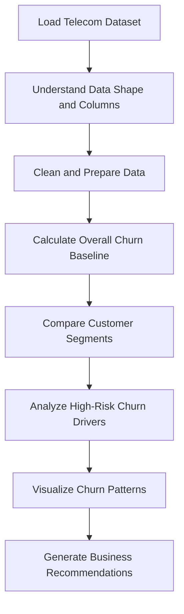
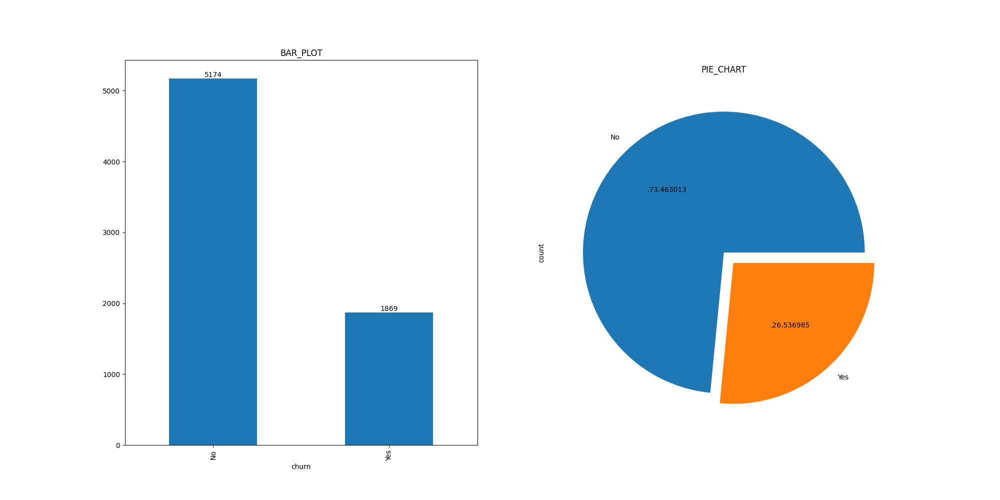
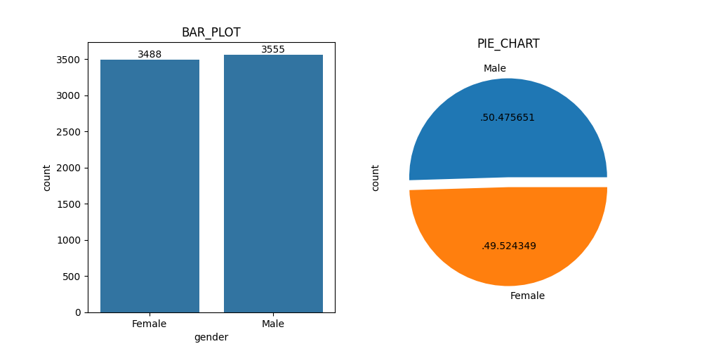
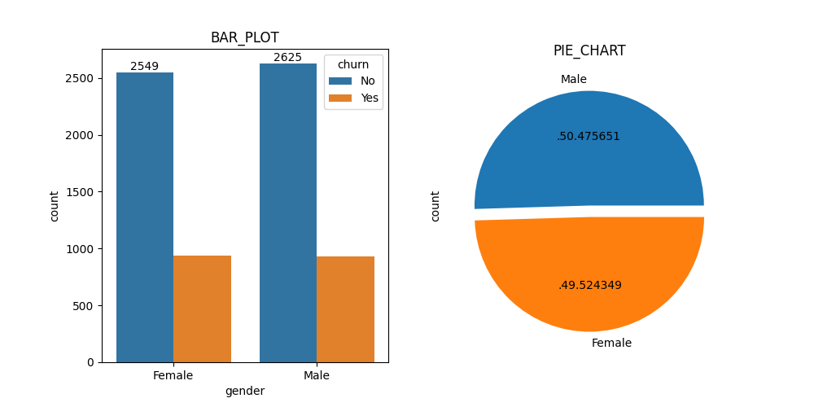
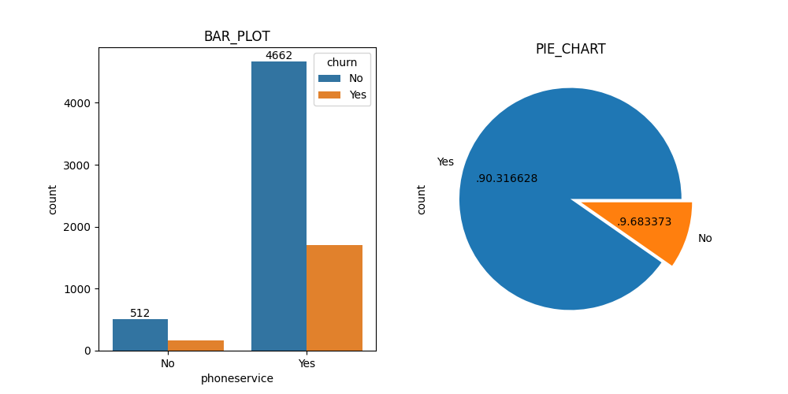
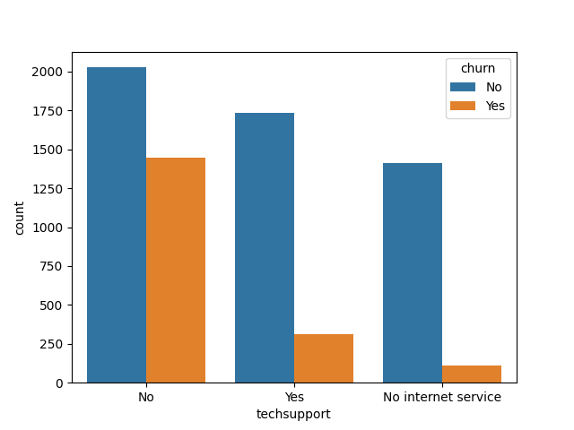
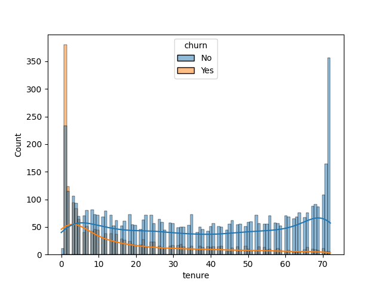
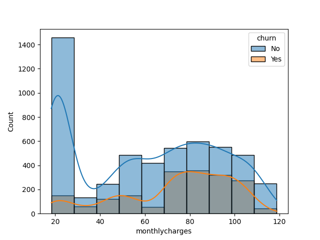

  # ChurnPulse: Telecom Customer Churn Analysis


## Project Overview

**ChurnPulse** is a telecom customer churn analysis project focused on identifying customer segments with higher churn risk using exploratory data analysis, feature comparison, encoding, correlation analysis, and visual storytelling.

The project analyzes **7,043 telecom customer records** across **21 columns** to understand how customer profile, service usage, contract type, billing behavior, internet service type, support services, tenure, and monthly charges influence customer churn.

The main objective is not only to calculate churn but to convert churn patterns into practical retention recommendations for business teams.

---

## Business Problem

Telecom companies lose revenue when existing customers discontinue services. Instead of treating all customers equally, the company needs to identify **which customer groups are more likely to churn** and **why those groups require targeted retention action**.

This project answers questions such as:

- Which customer segments show churn above the overall baseline?
- Does internet service type affect churn?
- Are senior citizens more churn-prone?
- Does lack of online security or tech support increase churn risk?
- How does monthly charge range relate to churn behavior?
- Which retention actions should be prioritized?

---

## Dataset Information

| Metric | Value |
|---|---:|
| Rows | 7,043 |
| Columns | 21 |
| Target Variable | Churn |
| Project Type | EDA + Business Insight Generation |
| Domain | Telecom Customer Retention |

### Key Columns Used

- `gender`
- `SeniorCitizen`
- `tenure`
- `PhoneService`
- `MultipleLines`
- `InternetService`
- `OnlineSecurity`
- `OnlineBackup`
- `TechSupport`
- `Contract`
- `PaymentMethod`
- `MonthlyCharges`
- `TotalCharges`
- `Churn`

---

## Tech Stack

| Area | Tools / Libraries |
|---|---|
| Programming | Python |
| Data Handling | Pandas, NumPy |
| Visualization | Matplotlib, Seaborn |
| EDA Techniques | Crosstab Analysis, Grouped Comparison, Baseline Comparison |
| Feature Work | Encoding, Column Cleaning, Categorical Analysis |
| Notebook Environment | Jupyter Notebook / VS Code |

---

## Project Workflow



---

## Visual Insights

### Overall Churn Distribution



### Gender Distribution



### Churn by Gender



### Churn by Phone Service



### Churn by Tech Support



### Churn by Tenure



### Monthly Charges vs Churn




## Key Findings

### 1. Overall churn baseline is around 26.5%

The project uses the overall churn rate as a **baseline benchmark**. This is important because every segment is judged against the base churn level instead of only looking at raw counts.

**Business meaning:**  
Any segment with churn much higher than 26.5% should be treated as a priority retention segment.

---

### 2. Fiber optic customers show very high churn risk

Customers using **Fiber optic internet service** show a churn rate of nearly **41.9%**, which is around **15 percentage points above the overall churn baseline**.

| Internet Service | Churn Rate |
|---|---:|
| DSL | 18.96% |
| Fiber optic | 41.89% |
| No internet service | 7.40% |

**Business interpretation:**  
Fiber optic customers may have higher expectations because they are likely paying more or expecting better performance. High churn in this segment may indicate issues related to price, service quality, speed reliability, or customer support experience.

**Recommended action:**  
Prioritize fiber optic users for service quality checks, proactive support, billing review, and retention offers.

---

### 3. Customers without online security churn more

Customers without **Online Security** show churn of nearly **41.8%**, which is significantly above the baseline.

| Online Security | Churn Rate |
|---|---:|
| No | 41.77% |
| Yes | 14.61% |
| No internet service | 7.40% |

**Business interpretation:**  
Customers without online security are more likely to leave. This suggests that bundled security add-ons may increase perceived value and reduce churn risk.

**Recommended action:**  
Promote online security as a retention bundle, especially for fiber optic and month-to-month customers.

---

### 4. Tech support gap creates churn opportunity

A major churn-risk group was observed among customers with **No Tech Support**. The notebook analysis also identifies a large non-senior-citizen segment without tech support where churn volume is high.

**Business interpretation:**  
Lack of technical support can reduce customer confidence, especially when internet-related services fail or billing expectations are not met.

**Recommended action:**  
Launch automated tech support, chatbot support, callback support, or onboarding guidance for customers without tech support.

---

### 5. Monthly charges between 70 and 100 show higher churn

Monthly charge ranges show clear churn variation.

| Monthly Charges Range | Churn Rate |
|---|---:|
| 18–30 | 9.80% |
| 30–40 | 28.11% |
| 40–50 | 31.89% |
| 50–60 | 20.84% |
| 60–70 | 20.66% |
| 70–80 | 39.37% |
| 80–90 | 36.25% |
| 90–100 | 37.87% |
| 100–110 | 32.75% |
| 110–120 | 13.02% |

**Business interpretation:**  
Customers in the **70–100 monthly charge range** show churn between **36% and 39%**, which is much higher than the baseline. This suggests price sensitivity or dissatisfaction among mid-to-high billing customers.

**Recommended action:**  
Review pricing plans, offer loyalty discounts, explain plan value clearly, and combine high-charge plans with value-added services.

---

### 6. Gender is not a major churn driver

Gender-based churn difference is very small.

| Gender | Churn Rate |
|---|---:|
| Female | 26.92% |
| Male | 26.16% |

**Business interpretation:**  
Gender should not be treated as a major churn driver because both groups are close to the overall churn baseline.

**Recommended action:**  
Avoid gender-based targeting. Focus more on service type, online security, tech support, tenure, contract, and monthly charges.

---

## Business Recommendations

| Priority | Segment / Issue | Recommendation |
|---:|---|---|
| High | Fiber optic users | Run service-quality checks and offer retention plans |
| High | No online security | Bundle online security with internet plans |
| High | No tech support | Introduce automated support and proactive troubleshooting |
| Medium | Monthly charges 70–100 | Review pricing, discounts, and value communication |
| Medium | Senior citizen support needs | Provide simplified support, backup assistance, and callback options |
| Low | Gender | Do not prioritize gender as a churn factor |

---

## Final Conclusion

This analysis shows that churn is not random. The strongest churn signals appear in service-related and billing-related segments, especially customers using **fiber optic internet**, customers with **no online security**, customers with **no tech support**, and customers paying in the **70–100 monthly charge range**.

The most important analytical step in this project is the use of a **baseline churn rate**. By comparing each customer segment against the overall churn baseline, the project separates normal churn behavior from high-risk churn patterns.

From a business perspective, the company should focus on improving service reliability, strengthening support systems, bundling online security, and creating targeted retention offers for high-charge and fiber optic customers.

---

## Resume-Ready Project Summary

Analyzed **7,043 telecom customer records** using Python-based EDA to identify churn patterns across tenure, internet service, online security, tech support, senior citizen status, and monthly billing. Established a **26.5% churn baseline** and identified high-risk segments including **fiber optic users with 41.9% churn**, customers without **online security with 41.8% churn**, and customers in the **70–100 monthly charge range with 36–39% churn**, generating actionable retention recommendations.

---

## How to Run This Project

### 1. Clone the repository

```bash
git clone https://github.com/Anshgallery/ChurnPulse_Project.git
cd ChurnPulse_Project
```

### 2. Install required libraries

```bash
pip install -r requirements.txt
```

If `requirements.txt` is empty, install the main libraries manually:

```bash
pip install pandas numpy matplotlib seaborn jupyter
```

### 3. Open the notebook

```bash
jupyter notebook app.ipynb
```

---

## How to Export Notebook Images for README

Create an `assets` folder:

```bash
mkdir assets
```

Then, inside your notebook, save important plots like this:

```python
plt.figure(figsize=(8, 5))
sns.countplot(data=data, x="Churn")
plt.title("Overall Churn Distribution")
plt.savefig("assets/overall_churn_distribution.png", bbox_inches="tight", dpi=300)
plt.show()
```

Use the same pattern for internet service, online security, tech support, monthly charges, and tenure charts.

---

## Author

**Ansh**  
Data Analytics & Machine Learning Intern Aspirant  
GitHub: [Anshgallery](https://github.com/Anshgallery)
